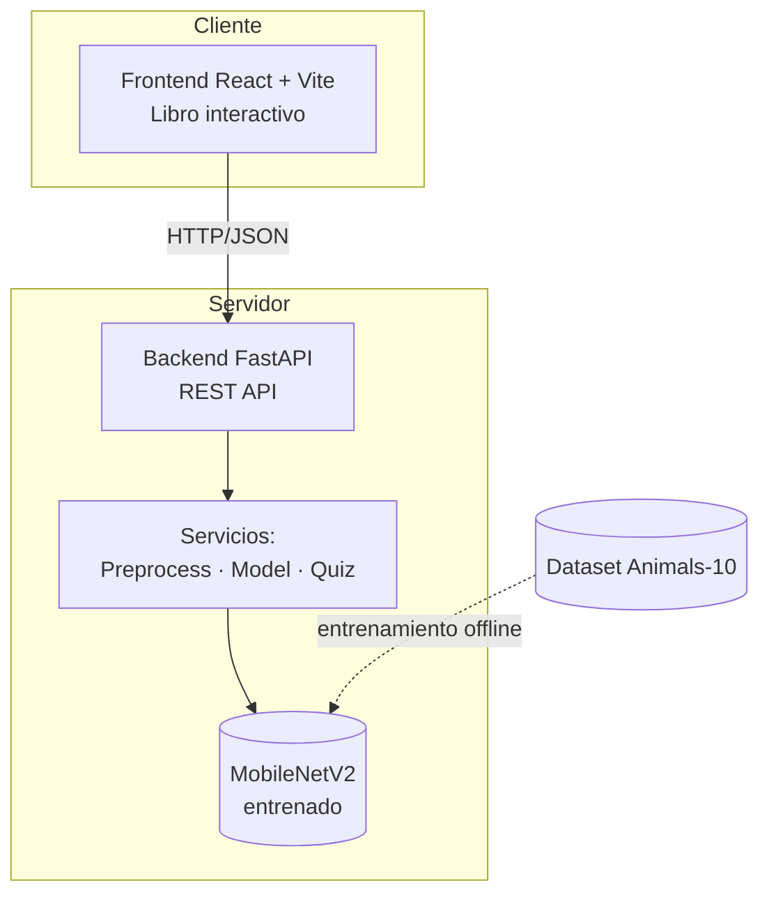

# Documentación Técnica — El Gran Libro de los Animales

Material técnico del sistema de clasificación de especies de animales para niños.
Sirve de base para el reporte del ETS.

## Contenido

| Archivo | Contenido |
|---------|-----------|
| [01-diagrama-clases.md](01-diagrama-clases.md) | Diagrama de clases (backend + servicios del modelo) |
| [02-casos-de-uso.md](02-casos-de-uso.md) | Diagrama de casos de uso (Niño, Profesor) |
| [03-diagramas-secuencia.md](03-diagramas-secuencia.md) | Secuencias de Identificar y Quiz |
| [04-maquina-estados.md](04-maquina-estados.md) | Máquina de estados del libro y del quiz |
| [05-pruebas-aceptacion.md](05-pruebas-aceptacion.md) | Pruebas funcionales, usabilidad y rendimiento |
| [metricas.md](metricas.md) | Métricas reales del modelo (generado por evaluate.py) |

## Resumen del sistema

**Objetivo:** Clasificar automáticamente ≥10 especies de animales por imagen, con
interfaz amigable para niños de primaria, incluyendo identificación con voz y un
juego de adivinanza.

## Arquitectura general



## Stack tecnológico

| Capa | Tecnología |
|------|-----------|
| Frontend | React 19, Vite, Bun, react-pageflip, motion |
| Backend | FastAPI, Uvicorn |
| Modelo | PyTorch + torchvision (MobileNetV2, transfer learning) |
| Voz | Web Speech API (navegador) |
| Dataset | Animals-10 (~26k imágenes, 10 clases) |

## Requerimientos

### Funcionales
| ID | Requerimiento |
|----|---------------|
| RF-01 | Cargar una imagen y clasificar la especie |
| RF-02 | Devolver la especie predicha con su confianza |
| RF-03 | Reproducir el nombre de la especie en voz alta |
| RF-04 | Mostrar un animal aleatorio en el quiz |
| RF-05 | Presentar opción múltiple (3 nombres) |
| RF-06 | Validar la respuesta e indicar si es correcta |
| RF-07 | Preprocesar la imagen (redimensionar + normalizar) |
| RF-08 | Mostrar el puntaje final en estrellas |

### No funcionales
| ID | Requerimiento |
|----|---------------|
| RNF-01 | Interfaz amigable para niños |
| RNF-02 | Predicción en menos de 3 segundos |
| RNF-03 | Accuracy del modelo ≥ 85% |
| RNF-04 | Ejecutable en local (frontend + backend) |
| RNF-05 | El modelo debe generalizar (evitar overfitting) |

## Reglas de negocio

- **RN-01:** El sistema solo reconoce las 10 especies entrenadas; si la confianza
  es menor a 85%, informa que no pudo reconocer al animal.
- **RN-02:** El quiz siempre incluye la respuesta correcta entre las 3 opciones.
- **RN-03:** Los distractores se eligen aleatoriamente entre las demás especies.
- **RN-04:** En una ronda de quiz, ningún animal se repite.

## Cómo ejecutar

**Backend:**
```bash
cd backend
.\.venv\Scripts\python.exe -m uvicorn main:app --port 8000
```

**Frontend:**
```bash
cd frontend
bun dev
```

**Re-entrenar el modelo:**
```bash
cd backend
.\.venv\Scripts\python.exe train.py
```

**Evaluar métricas:**
```bash
cd backend
.\.venv\Scripts\python.exe evaluate.py
```
