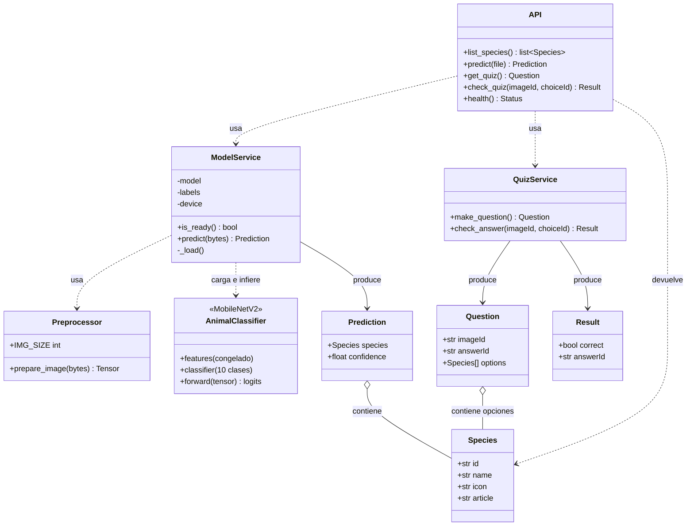

# Diagrama de Clases

Representa las clases y servicios principales del sistema, tanto del backend
(Python/FastAPI) como de los servicios del modelo de IA.

## Descripción de clases

| Clase | Responsabilidad |
|-------|-----------------|
| **API** | Punto de entrada FastAPI. Expone los endpoints REST y orquesta los servicios. |
| **ModelService** | Carga el modelo entrenado (perezoso) y ejecuta la inferencia sobre una imagen. |
| **Preprocessor** | Redimensiona (224×224) y normaliza la imagen antes de la inferencia. |
| **QuizService** | Genera preguntas aleatorias y valida las respuestas del quiz. |
| **AnimalClassifier** | Red neuronal MobileNetV2 con transfer learning (base congelada + cabeza de 10 clases). |
| **Species / Prediction / Question / Result** | Estructuras de datos que viajan entre backend y frontend (DTOs). |
