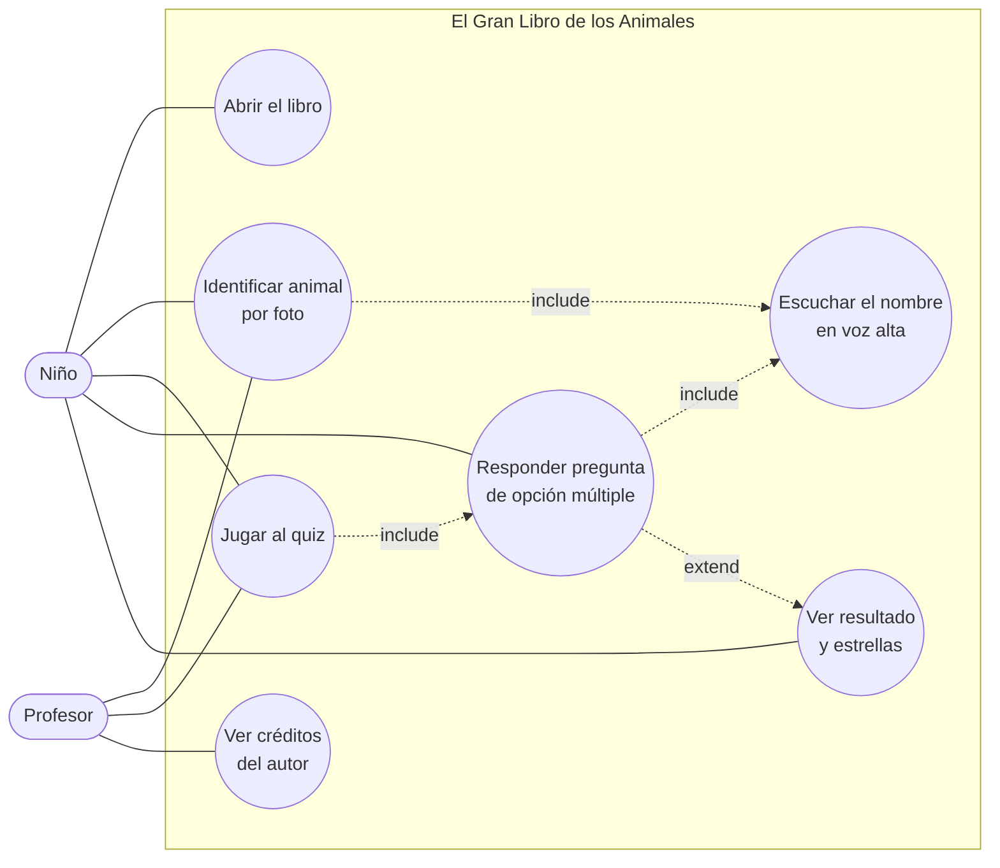

# Diagrama de Casos de Uso

Actores del sistema: el **Niño** (usuario principal) y el **Profesor** (guía/supervisor).
Ambos pueden usar todas las funciones; el profesor típicamente acompaña.

## Descripción de casos de uso

| ID | Caso de uso | Actor | Descripción |
|----|-------------|-------|-------------|
| CU-01 | Abrir el libro | Niño | Pasa la portada para entrar al cuento. |
| CU-02 | Identificar animal por foto | Niño, Profesor | Sube una foto; el modelo predice la especie. |
| CU-03 | Escuchar el nombre | Niño | El sistema dice el nombre del animal en voz alta (TTS). |
| CU-04 | Jugar al quiz | Niño, Profesor | Inicia la ronda de preguntas de adivinanza. |
| CU-05 | Responder pregunta | Niño | Elige el nombre correcto entre 3 opciones. |
| CU-06 | Ver resultado y estrellas | Niño | Al terminar, ve su puntaje en estrellas. |
| CU-07 | Ver créditos del autor | Profesor | Consulta los datos del alumno (verificación de autoría). |

**Relaciones:**
- *include*: Identificar y Responder **siempre** dicen el nombre en voz alta.
- *extend*: al responder la última pregunta, se **extiende** hacia el resultado.
