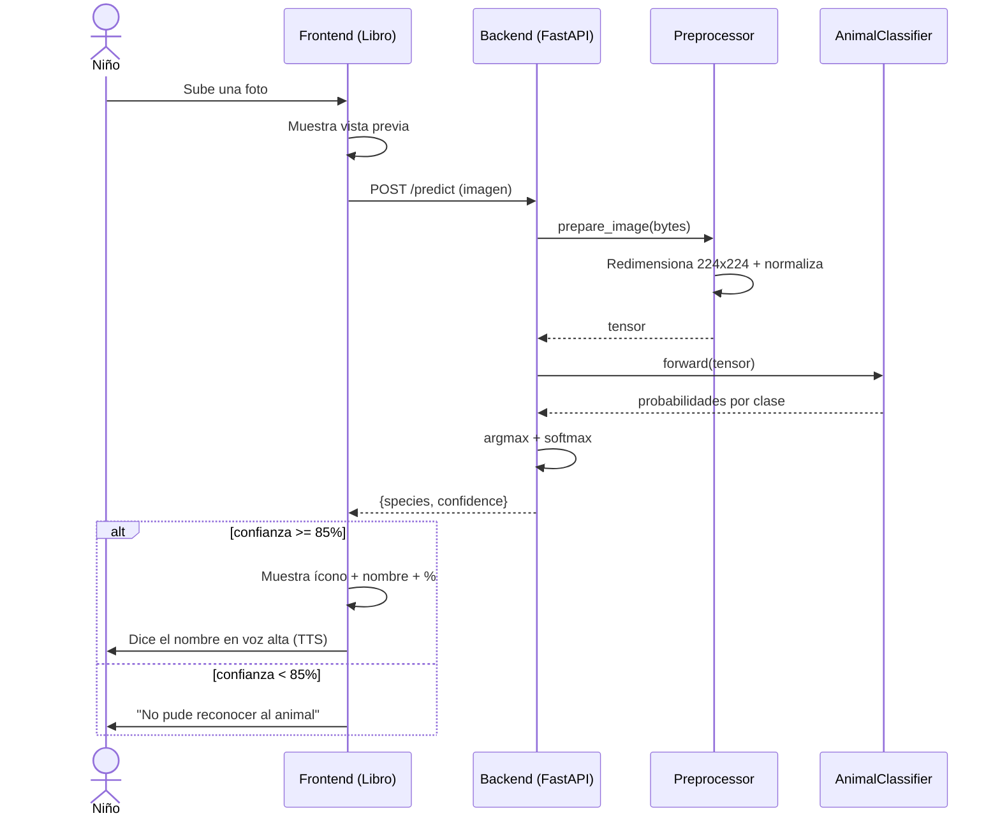
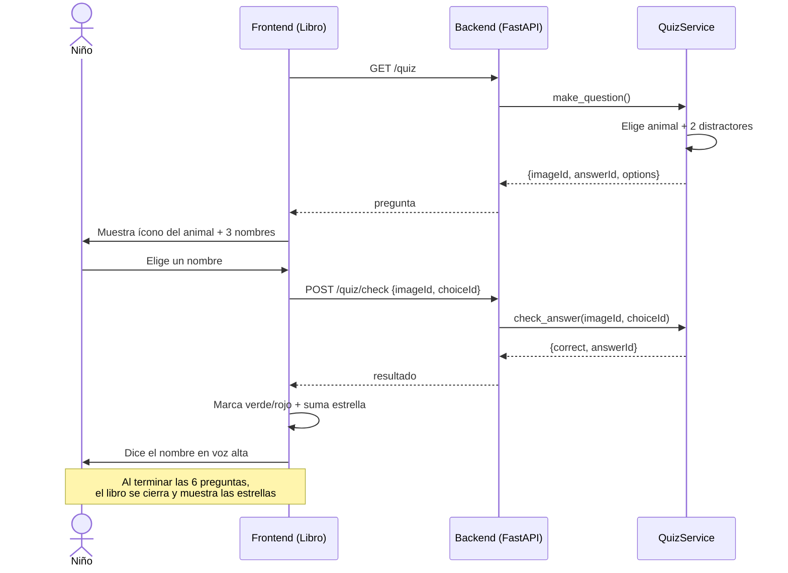

# Diagramas de Secuencia

## Secuencia 1: Identificar un animal por foto

Muestra el flujo desde que el niño sube una foto hasta que escucha el nombre.

## Secuencia 2: Responder una pregunta del quiz

Muestra el flujo de una ronda de adivinanza.

