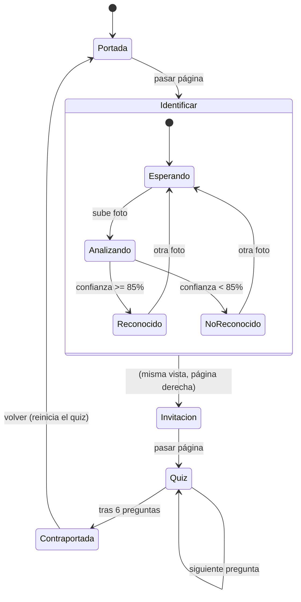
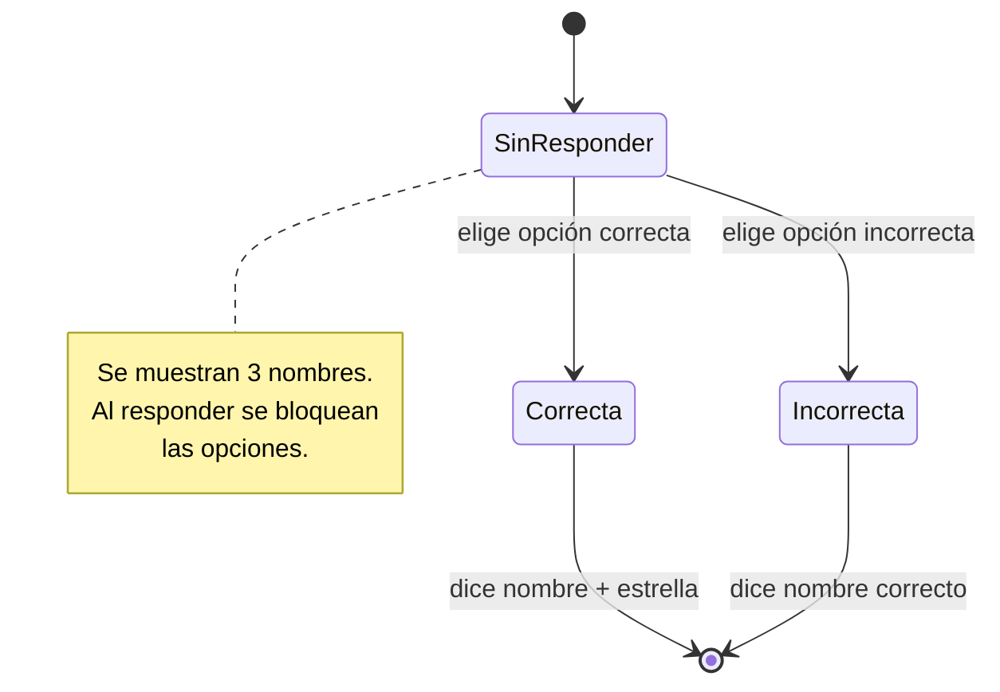

# Máquina de Estados

## Estados del Libro (navegación)

Refleja el recorrido lineal del cuento: la portada, la sección de identificar,
las preguntas del quiz y la contraportada.

## Estados de una pregunta del Quiz

## Descripción de estados

| Estado | Descripción |
|--------|-------------|
| **Portada** | Libro cerrado; muestra la ilustración de portada. |
| **Identificar** | El niño sube fotos y recibe predicciones. |
| **Invitación** | Página que invita a jugar el quiz. |
| **Quiz** | Ronda de 6 preguntas de adivinanza (animales sin repetir). |
| **Contraportada** | Muestra el puntaje en estrellas y los créditos. |
| **Analizando** | El modelo está procesando la imagen. |
| **Reconocido / NoReconocido** | Resultado según el umbral de confianza (85%). |
